# **Traffic Sign Recognition** 

#### 1. Project files

A guide through the source code can be found [here](https://github.com/benenaes/CarND-Traffic_Sign_Classifier/blob/master/Traffic_Sign_Classifier.ipynb)

### Data Set Summary & Exploration

The characteristics of the pickled training, validation and data sets were derived using Numpy (*shape* and *unique*) .

The traffic sign labels from the CSV file were parsed by the Python *CSV* library.

* The size of training set is 34799
* The size of the validation set is 4410
* The size of test set is 12630
* The shape of a traffic sign image is (32, 32, 3)
* The number of unique classes/labels in the data set is 43

#### 2. An exploratory visualization of the dataset.

Here is an overview of all the traffic sign classes from the database:

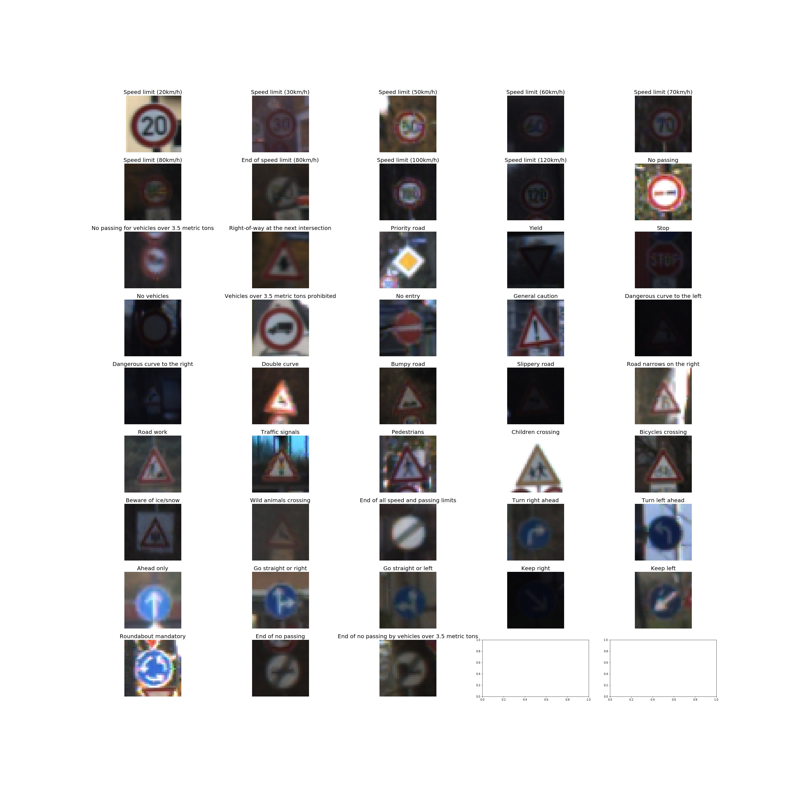

A histogram with the number of training figures per traffic sign class is given here:

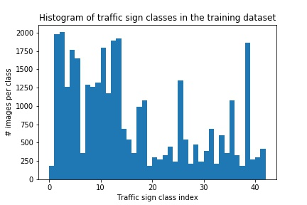  

### Design and Test a Model Architecture

#### 1. Preprocessing

Normalization is performed as a fixed part of the network using the *tf.image.per_image_standardization* functionality. This has the advantage that no explicit steps need to be made for training, validation and testing data.

No colour conversion has been performed as different sources suggest to convert to greyscale, HSV, YUV and it is thus unclear what is the most optimal. Therefore, it was decided to let the neural network train the optimal conversion as the first step (a 1x1 convolution with depth '3')

As the histogram of the training dataset shows, each traffic sign class isn't equally represented. I decided to add additional images for each under-represented class by changing the perspective of existing examples via small random perspective transformations (using OpenCV 3).

An example of such transformations of an existing 70 km/h speed limit sign is shown here:

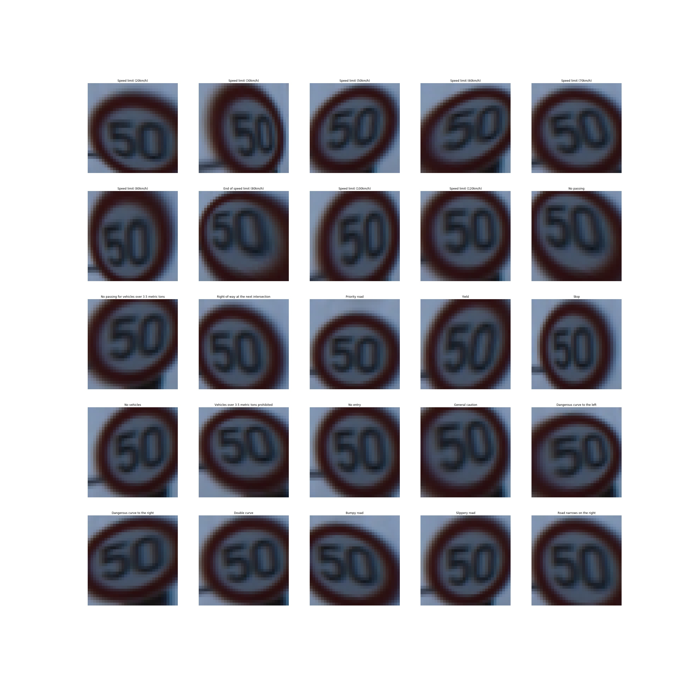

A new histogram with the added training data was generated and resulted in the following:

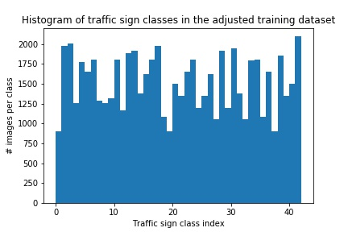

The number of additional random perspective transformations were topped, because the network might start to perceive the background/periphery of these traffic signs as part of the features that define the traffic sign class. The bounding boxes in the pickled data could possibly be used to get rid of as much background as possible before applying the perspective transformation.

Possible extensions to the generation of extra images, could be random adjustment of brightness (through RGB/HSV conversion). It was specifically not opted to use flip or rotation operations as these could generate traffic signs that have a complete different meaning. Zooming and translation are just special cases of perspective transformation.

#### 2. Model architecture

The final model consisted of the following layers:

|               Description                |      Layer      |
| :--------------------------------------: | :-------------: |
|            32x32x3 RGB image             |      Input      |
| colour conversion: 1x1 stride, valid padding, outputs 32x32x3 | Convolution 1x1 |
| 1x1 stride, valid padding, outputs 28x28x108 | Convolution 5x5 |
|            outputs 14x14x108             |     RELU 1      |
|      2x2 stride,  outputs 14x14x108      |  Max pooling 1  |
| 1x1 stride, valid padding, outputs 10x10x108 | Convolution 5x5 |
|             outputs 5x5x108              |     RELU 2      |
|       2x2 stride,  outputs 5x5x108       |  Max pooling 2  |
| Flattened output of Max Pooling 1 and Max Pooling 2 |     Flatten     |
| 256 hidden nodes, RELU activation function with dropout rate 50% | Fully connected |
| 256 hidden nodes, RELU activation function with dropout rate 50% | Fully connected |
|             43 output nodes              |     Softmax     |

It has to be noted that the outputs of Max Pooling 2 **and Max Pooling 1** were fed to the first fully connected layer. This was done to be able to make decisions based on smaller and larger scale features. Inception modules could have been used here as well.

Further on, each fully connected layer has a dropout rate of 50%. This dropout is of course only applicable during training.

Most of the parameters of this network structure can be tuned through the *NetParameters* class. This class also calculates the output size of each layer.

#### 3. Training

Weights were initialized with a truncated standard normal distribution with mean 0 and standard deviation 0.1. The Xavier initializer that can be used off-the-shelf in Tensorflow could have been used as well.

An Adam optimizer was used to optimize the network variables with a starting learning rate of 0.001 (the learning rate is adapted by the Adam optimizer itself). The other hyper-parameters of the Adam optimizer were the Tensorflow defaults.

L2 regularization was used to avoid overfitting (the weight variables of the fully connected networks were stored in the *tf.GraphKeys.REGULARIZATION_LOSSES* collection and is used during the training stage to calculate an extra loss factor). The scaling factor of L2 regularization was set at 0.00001

A batch consists of max. 128 images (this could possibly be increased on other machines). The training stage took 50 epochs. The validation accuracy increases more slowly during the last epochs and also starts to oscillate a bit. A longer training stage (i.e. more epochs) could demonstrate if even better performance on the validation set could be achieved.  

#### 4. Approach to the solution

My final model results were:
* validation set accuracy of 96.6 %
* test set accuracy of 96.5 %

Iterative approach:

* I started from a LeNet-5 implementation with network parameters based on [yann.lecun.com/exdb/publis/pdf/sermanet-ijcnn-11.pdf]()  , but without the link from the first max pool layer to the fully connected layer. I added this later on to see (for exercise), but I didn't see the performance improve drastically.
* Some of the steps like fixed colour conversion and local normalization were left out.
* This architecture worked already quite well. Certainly the number of nodes in the fully connected layers seemed to be well chosen as some of my experiments showed that increasing the number of hidden nodes actually caused overfitting.
* The learning rate was adjusted from 1 to 0.00001. Although the Adam optimizer adjusts this learning rate and a lot of experiments have to be made (due to random nature of the weight initializations) to be able to find the right learning rate, I settled for learning rate 0.001
* I also played around with the L2 regularization factor: I tried values from 1e-6 to 1e-3
* Dropout was added to the network as an additional countermeasure against overfitting.
* More convolution layers and inception modules and more hidden nodes in the fully connected layers could have been added (like e.g. in AlexNet, GoogLeNet), but this would be a research project on its own.

### Test a Model on New Images

#### 1. Choose five German traffic signs found on the web and provide them in the report. For each image, discuss what quality or qualities might be difficult to classify.

Here are five German traffic signs that I found on the web:

|  | 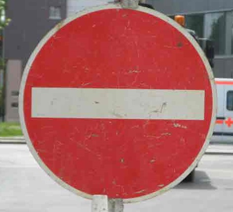 | 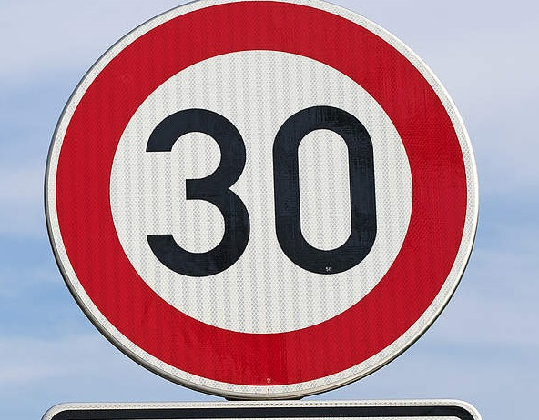 | 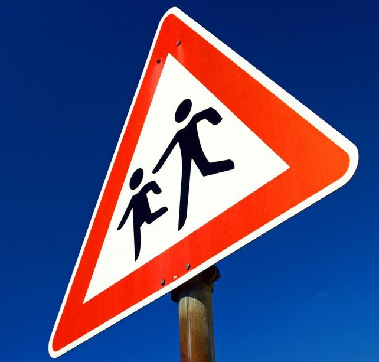 | 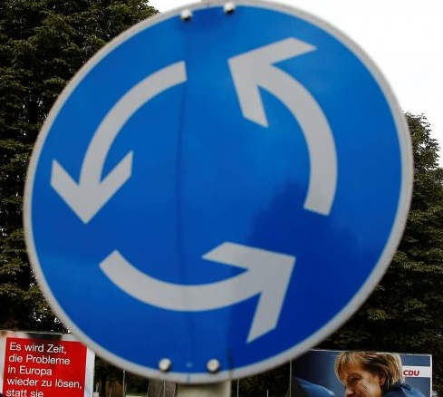 |
| ----------------------------- | ------------------------------- | ------------------------- | ------------------------- | ------------------------------- |
| Road work                     | No entry                        | Speed limit (30 km/h)     | Children crossing         | Roundabout mandatory            |

The first two traffic signs are a bit dirtier, so it might be interesting to see how the network copes with that. The third has a strange vertical texture pattern on the traffic sign itself. The fourth and fifth have different perspectives.

#### 2. Predictions on these new traffic signs

Here are the results of the prediction:

|         Image         |          Prediction          |
| :-------------------: | :--------------------------: |
|       Road work       |          Road work           |
|       No entry        |           No entry           |
| Speed limit (30 km/h) |    Speed limit (30 km/h)     |
|   Children crossing   | Dangerous curve to the right |
| Roundabout mandatory  |     Roundabout mandatory     |

The model was able to correctly guess 4 of the 5 traffic signs, which gives an accuracy of 80%. It was expected that the 4th new test image would be difficult to predict, due to the large perspective transformation from the standard in-front view. This class was also well under-represented and contained some very blurry training examples.

#### 3. Describe how certain the model is when predicting on each of the five new images by looking at the softmax probabilities for each prediction. Provide the top 5 softmax probabilities for each image along with the sign type of each probability. 

The four well-predicted test images had high probabilities each time. The top five probabilities of the problematic fourth image (children crossing) show that the network is a bit more uncertain about its prediction, although still quite certain about its wrong guess. The correct label is only the second most probable option for the "children crossing" test image.

| Top probability |          Prediction          |
| :-------------: | :--------------------------: |
|      1.00       |          Road work           |
|      1.00       |           No entry           |
|      1.00       |    Speed limit (30 km/h)     |
|       0.7       | Dangerous curve to the right |
|      1.00       |     Roundabout mandatory     |

The bar charts for the five top probabilities for each new test image is added here (visualized with *matplotlib.barh()*):

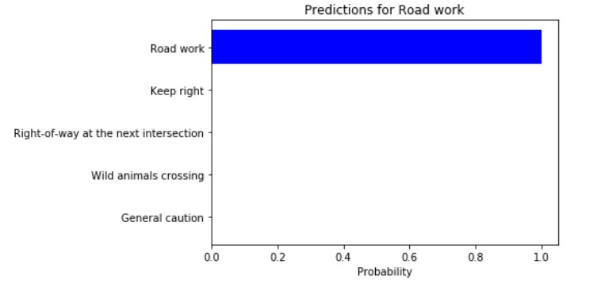

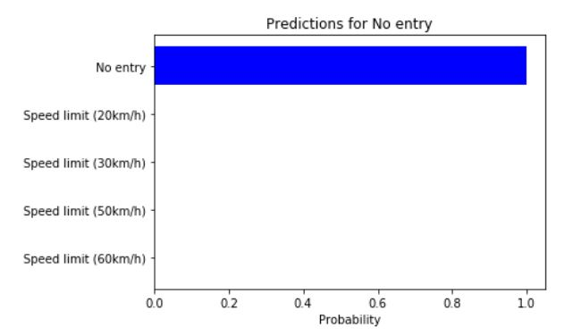

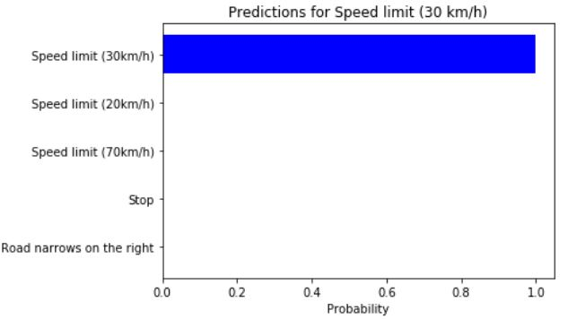

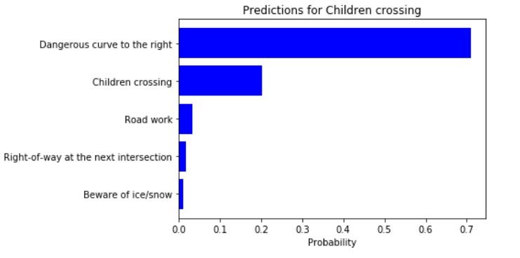

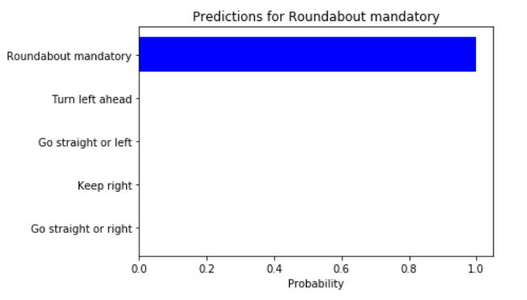

### (Optional) Visualizing the Neural Network (See Step 4 of the Ipython notebook for more details)
#### 1. Discuss the visual output of your trained network's feature maps. What characteristics did the neural network use to make classifications?

I only did a brief investigation on the output of the first convolution layer (retrieved through *get_default_graph().get_tensor_by_name*), caused by the new test image with the "Roundabout mandatory" traffic sign.

It is nice to see that in some cases the border is highlighted, in other cases the arrows.

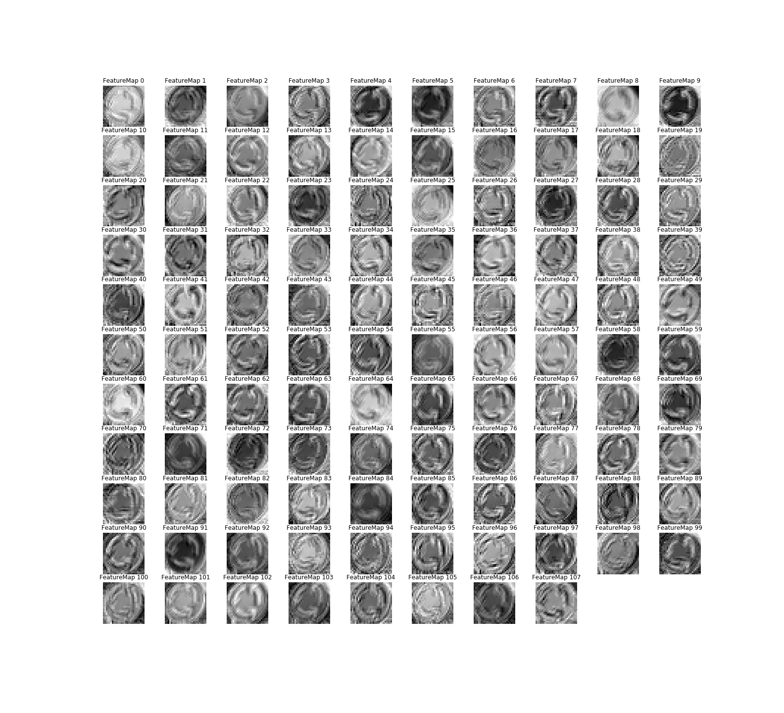

